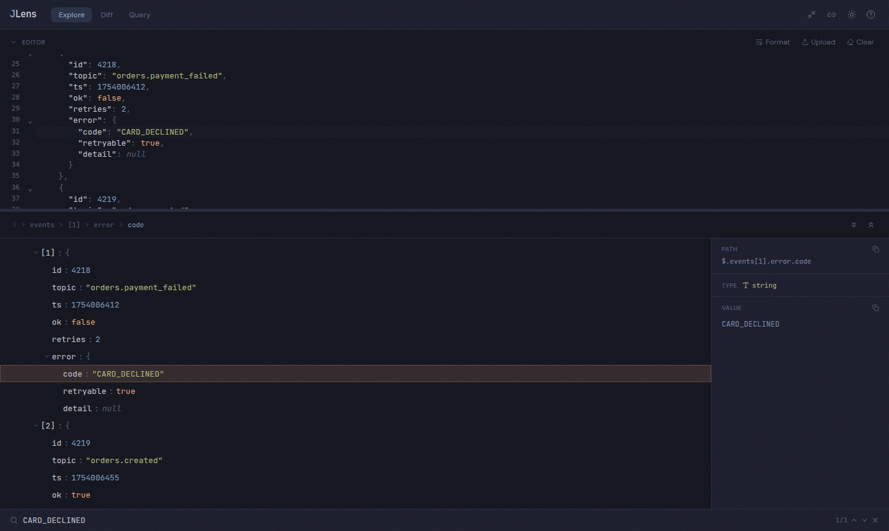

# JLens

**A JSON debugger for messy, real-world payloads. Runs entirely in your browser.**

[**Open JLens →**](https://j-lens.vercel.app)



---

## Why

You get handed a 2MB API response, a Kafka message, or a log payload, and you need to answer one of these:

- *Where is `request_id` in this thing?*
- *What changed between staging and prod?*
- *Which of these 4000 records has a null?*

Browser devtools can't search by value or diff two payloads. `jq` needs you to know the shape before you can query it. Most online formatters upload your payload to a server, which is a non-starter when it contains customer data.

JLens does those three jobs in one page, and never sends your data anywhere.

## Privacy

**Your payload never leaves your browser.** There is no backend and no upload. Parsing, searching, querying, and diffing all run client-side in JavaScript. You can verify it in the Network tab — or read `src/`, it's all here.

The one exception is the share link, which you opt into explicitly: it compresses the payload into the URL fragment so a teammate can open the same view. Treat those links like the data inside them.

## What it does

**Explore** — virtualized tree that stays smooth past 10k nodes. Expand/collapse, type-colored values, collapsed previews (`{3}`, `[12]`), a clickable breadcrumb trail, and a detail panel showing the resolved JSONPath and full value — both one click to copy.

**Search** — substring search across keys and values, or scope it with `key:` / `value:` prefixes. Auto-expands ancestors, scrolls to the active match, and counts them.

**Query** — JSONPath expressions evaluated live via `jsonpath-plus`, with history kept in localStorage.

**Diff** — structural, path-based comparison of two payloads, side-by-side or inline, with added/removed/modified counts.

**Table** — flatten an array of objects into a sortable table.

**Share** — compress the payload into a URL (via `lz-string`) and send it to someone.

### Input it tolerates

Paste, upload, or drag-and-drop a file. Malformed JSON is repaired automatically — unquoted keys, single quotes, trailing commas, comments, and Python-style `True` / `False` / `None` — with a banner telling you what was fixed and the corrected JSON to copy. Genuine syntax errors report their line and column.

Payloads over 1MB parse in a Web Worker, so the UI never blocks.

### Editor

A real CodeMirror 6 editor, not a textarea: syntax highlighting, line numbers, code folding, bracket matching, line wrapping. It's **synced both ways** — click a tree node and the editor scrolls to that line; click in the editor and the matching tree node is selected. Format/minify toggle, resizable, and lazy-loaded so it stays out of the initial bundle.

Dark and light themes, following `prefers-color-scheme` and remembered across sessions.

## Keyboard shortcuts

| Keys | Action |
| --- | --- |
| `Ctrl`+`F` / `Ctrl`+`K` | Focus search |
| `Enter` / `Shift`+`Enter` | Next / previous match |
| `Ctrl`+`E` | Expand all nodes |
| `Ctrl`+`Shift`+`E` | Collapse all nodes |
| `?` | Show all shortcuts |
| `Escape` | Clear search / close dialog |

## Development

```bash
npm install
npm run dev      # dev server on :5173
npm test         # 186 tests
npm run lint
npm run build    # type-check + production build
npm run og       # regenerate the social preview card
```

## Architecture

```
src/
├── core/          parser, search, diff, repair, share — pure logic, no React
├── editor/        CodeMirror 6 theme + bidirectional sync (Lezer ↔ JSON paths)
├── stores/        Zustand: json, search, query, ui
├── hooks/         bridges between stores and components
├── components/    tree, editor, detail panel, search, diff, query, table
└── workers/       off-main-thread parsing and formatting
```

The load-bearing decision: JSON is parsed into a **flat `Map<path, JsonNode>`** rather than a nested tree. Search becomes one linear pass, virtualization only needs a list of visible ids, and editor↔tree sync is a map lookup. Most of the rest follows from that.

`core/` imports no React, which is why it's straightforward to test.

**Stack:** Vite 7 · React 19 · TypeScript 5.9 · Tailwind 4 · Zustand 5 · CodeMirror 6 · TanStack Virtual · jsonpath-plus · jsonrepair · lz-string · Vitest

Production build is ~92KB gzipped, plus a ~93KB editor chunk loaded on demand.

## Status

v1.2, actively worked on. See [`docs/ROADMAP.md`](docs/ROADMAP.md) for what's shipped and what's planned.

Known rough edges, named honestly:

- Object keys containing `.` collide in the flat path map, so a node can be dropped from the tree (`{"a.b": 1, "a": {"b": 2}}`)
- Integers beyond 2^53 lose precision and duplicate keys are silently dropped — both inherited from `JSON.parse`
- Array diffing is index-based, so a reordered array reads as entirely modified
- The tree has no ARIA roles or keyboard navigation yet
